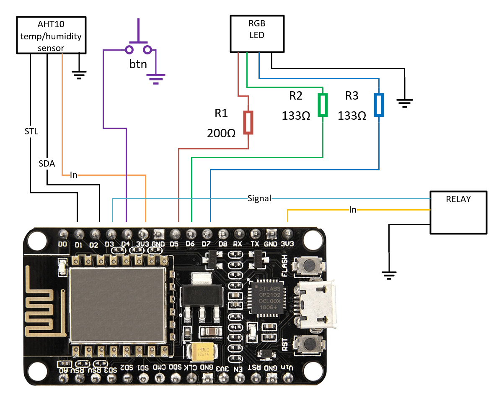

# HumiditySwitch

This is a petproject of mine made out of spare components I had laying around.
It's a smart plug made to control a humidifier (or anything else that is plugged in) based on the humidity in the room.

Just for fun I added a web API to control it and an indicator LED and a button for manual control.

## Remote control

The device exposes a web API that can be used to control it.  
There's no authentication for now (I'll add it at some point).  

`GET /` - Returns info about the device
Response:
```json
{
"status": 200,
"overrideState": 0, // 0 - off, 1 - force on, 2 - force off
"humidity": 45.31,
"sensorTemperature": 27.41
}
```

`GET /sensor` - Returns the current humidity and temperature  
Response:
```json
{
"status": 200,
"humidity": 45.43,
"sensorTemperature": 27.4
}
```

`GET /override?state=[0-2]` - Overrides the switch: 0 - reset, 1 - force on, 2 - force off  
Response:
```json
{
"status": 200,
"message": "Set override mode to <state>"
}
```

Be warned that the name of the query param (e.g. "state") doesn't matter, but it's position does!  
`/test?one=1&two=2` is the same as `/test?two=1&two=2`, but not the same as `/test?two=2&one=1`

## Hardware

- [ESP8266](https://en.wikipedia.org/wiki/ESP8266). Specifically I used a [NodeMCU v3](https://www.nodemcu.com/index_en.html).
- [AHT10](https://esphome.io/components/sensor/aht10.html) temperature and humidity sensor.
- Any 220v to 5v power supply
- One channel relay module (Read [3v 5v issues](#3v-5v-issues) below)
- Any button
- An RGB LED

## Wiring



## 3v 5v issues

The NodeMCU v3 has a UV port that bypasses the board and outputs USB voltage directly, but signal pin connected to the board is still 3v.
Because of this, the relay doesn't switch properly when connected to the UV port.
So now my relay runs on 3v. Technically this is out of spec and might bring unnecessary load to the board and it's power converter.  
I don't think this will cause lots of problems in the long run, but I'm not an expert so do this at your own risk 😉
